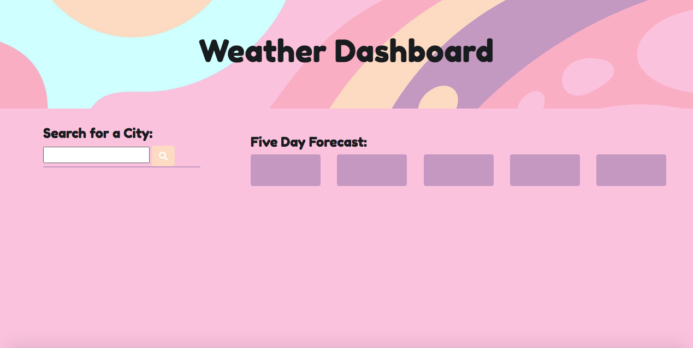
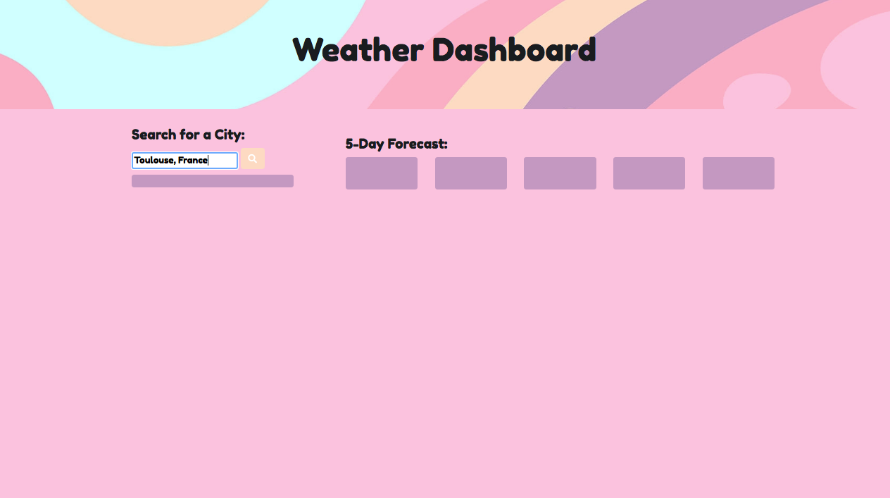
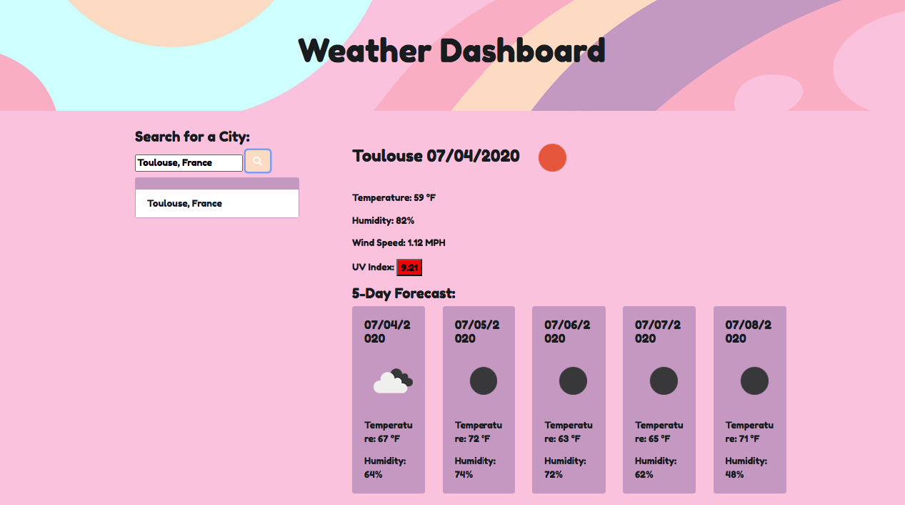
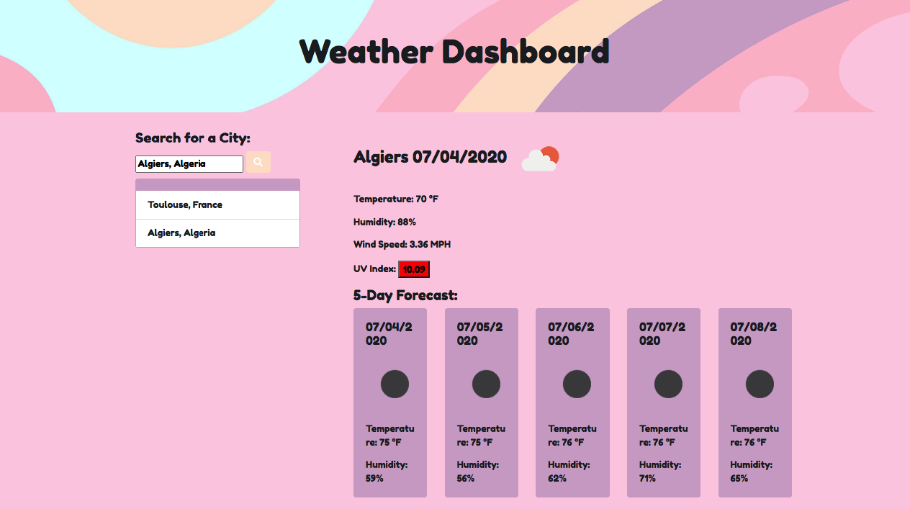
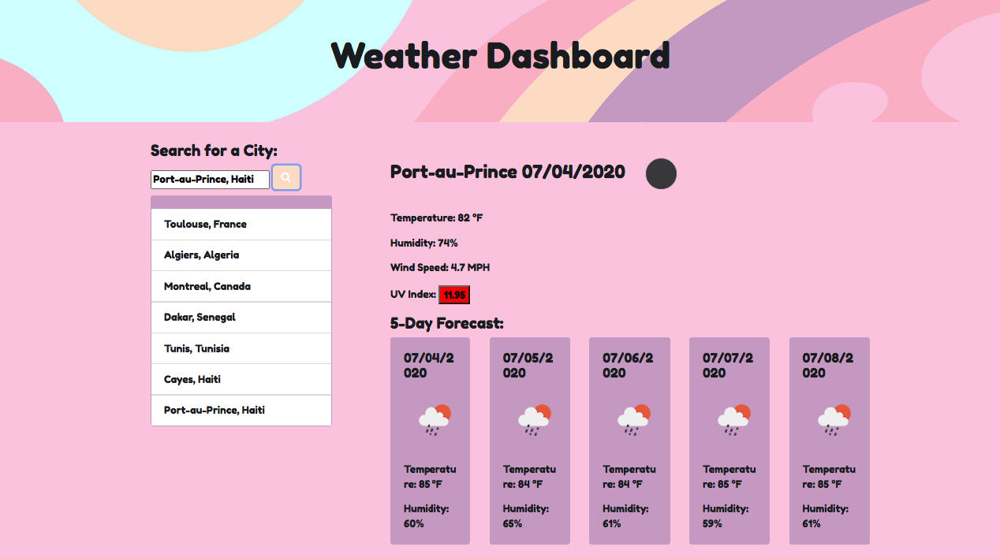

# Weather Dashboard

## Table of Contents
*  [Description](#description)
*  [User Story](#user-story)
*  [Features of the Application](#features-of-the-application)
*  [Preview of Weather Dashboard](#preview-of-weather-dashboard)
*  [Links](#links)
*  [Usage](#usage)
*  [Acknowledgments](#acknowledgments)
*  [Built Using](#built-using)
*  [License](#license)
*  [Questions](#questions)

## Description

Server-side APIs are an interface often used by companies to allow users a way to interact and gain access to their information. For this weather dashboard application, I used the [OpenWeatherMap API](https://openweathermap.org/api) in order to gather information about the weather (current and future conditions) for a specified city.

The retrieved data from the OpenWeatherMap API call provided detailed information regarding the forecast, ultraviolet (UV) index, humidity levels, longitudinal and latitudinal coordinates, wind speeds, and visibility, among other things. Using this bulk information, I was able to sift through the JSON object, extract the necessary information to render onto the page, and build a weather dashboard that is both dynamic and functional.

## User Story
~~~
AS A traveler  
I WANT to see the weather outlook for multiple cities  
SO THAT I can plan a trip accordingly
~~~

## Features of the Application
~~~
GIVEN a weather dashboard with form inputs  
WHEN I search for a city  
THEN I am presented with current and future conditions for that city and that city is added to the search history  
WHEN I view current weather conditions for that city  
THEN I am presented with the city name, the date, an icon representation of weather conditions, the temperature, the humidity, the wind speed, and the UV index
~~~

## Preview of Weather Dashboard

The following images demonstrate the application functionality:

The following images demonstrate the use of ``local storage`` to save the previously search cities across browser sessions. When the user opens the weather dashboard, they are presented with the last searched city forecast.:

## Links

1. [Deployed Application](https://rh9891.github.io/WeatherDashboard)

2. [Github Repository](https://github.com/rh9891/WeatherDashboard)

## Usage

The following example of usage displays the use of the ajax call to the OpenWeatherMap API to attain information about a city from a JSON object:
~~~
var APIKey = "&units=imperial&appid=e7111b1f6589775ae781984a6af9beb7";
var queryURL = "https://api.openweathermap.org/data/2.5/weather?q=";
var citySearch = queryURL + city + APIKey;
$.ajax({
		url: citySearch,
		method: "GET"
	}).then(function(weatherData)
~~~

## Acknowledgments

A heartfelt thanks to Github user, Jody Russell, whose code I looked to for inspiration and guidance whenever I found myself stuck in creating the weather dashboard application, especially when coding the UV index (and requiring the second ajax call) and understanding how to render the weather icons onto the page.

## Built Using

Listed below are the frameworks and guides that made building this weather dashboard application possible.:

* [Bootstrap](https://getbootstrap.com)
* [JQuery](https://jquery.com)
* [OpenWeatherMap API Documentation](https://openweathermap.org/current)

## License

This application does not currently have any licenses.

The user is not permitted to use, modify, or share any parts of it. Though the code for this application is hosted on Github, where you are allowed to view and fork the code, this does not imply that the user is permitted to use, modify, or share the contents of this application for any purpose.

## Questions

If you have any questions, comments, or issues regarding this weather dashboard application, please don't hesitate to contact me either via [Github](https://github.com/rh9891) or via email at <romie.hecdivert@gmail.com>.